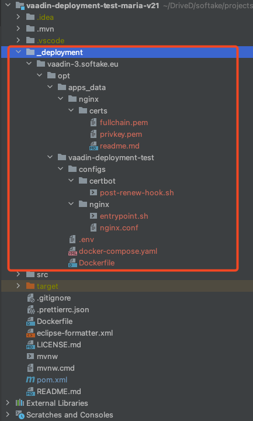
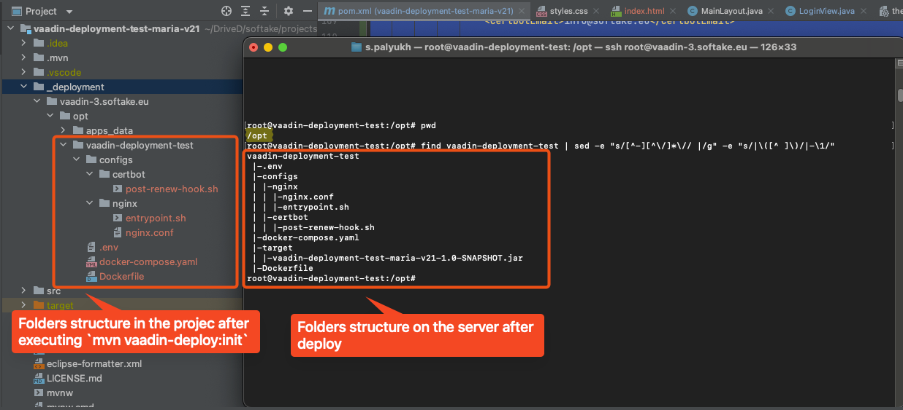

# Vaadin Deploy Maven Plugin

## Overview

The **Vaadin Deploy Maven Plugin** is a custom Maven plugin designed to automate the deployment of Vaadin applications
to a remote server via SSH. It simplifies the process of transferring Vaadin application files to a remote server,
ensuring the remote directories exist, and executing post-deployment commands.

## Features
 
- Generates a `docker-compose.yml` file with all required services and configurations.
- Deploys the project to a remote server via SSH.
- Generates SSL certificates using Certbot.
- Supports local development with a generated `docker-compose.yml`.


## Requirements

- Vaadin project
- Java 8 or higher
- Apache Maven 3.x
- `docker compose` installed on the remote server
- SSH access with a key pair or password
- User permissions to execute `docker compose` and create necessary files/directories
- A domain name mapped to the remote server

## Quick start 

To deploy your Vaadin project to a linux server you have to do the following:

1. **Configure the Plugin** in your `pom.xml` (see examples below).
2. **Initialize Deployment Configurations**   by executing maven goal: `mvn vaadin-deploy:init `
3. **Build your Vaadin project:** `mvn clean package `
4. **Deploy your Vaadin project** to the server by executing one of the following maven goals (depending on a server type):
```shell
   mvn vaadin-deploy:deploy-tst  # TST server
   mvn vaadin-deploy:deploy-qa   # QA server
   mvn vaadin-deploy:deploy-stg  # STG server
   mvn vaadin-deploy:deploy-prod # PROD server
```   

### Plugin Configuration

```xml
<plugin>
    <groupId>eu.softake.tools.mvn</groupId>
    <artifactId>vaadin-deploy-maven-plugin</artifactId>
    <version>1.0.0</version>
    <configuration>
        <!-- put your email       -->
        <certbotEmail>info@some.co</certbotEmail>
        <servers>
            <server>
                <type>TST</type>
                <!--  put your domain   -->
                <domain>vaadin-3.softake.eu</domain>
                <deployDir>/opt/vaadin-app</deployDir>
                <appsDataDir>/opt/apps_data</appsDataDir>
                <!-- put the required DB: postgres, mariadb, nodatabase -->
                <dbProvider>postgres</dbProvider>
                <sshConnection>
                    <!-- put ssh hostname -->
                    <hostName>vaadin-3.softake.eu</hostName>
                    <!-- put your ssh username -->
                    <user>root</user>
                    <!-- put your ssh password -->
                    <password>777888999</password>
                </sshConnection>
            </server>
        </servers>
    </configuration>
</plugin>
```

### How It Works

1. Running `mvn vaadin-deploy:init` generates all required deployment configurations under the `_deployment/` directory.

2. Generated Folder Structure

    The `_deployment/` directory contains a subfolder named after the configured domain (e.g., `vaadin-3.softake.eu`).




**Please pay attention!** The folder structure generated by the plugin that you see inside the domain folder will be copied to the server as is. 



3. Services Included in docker-compose.yml

-	Database (optional) – PostgreSQL or MariaDB
-	Vaadin App
-	Proxy – Nginx
-	Certbot – Handles SSL certificate generation

4. Deployment Process

-	Stops the existing docker-compose project (if applicable).
-	Backs up deployment configurations on the server.
-	Copies updated configurations from `_deployment/${domain}`.
-	Starts the docker-compose project.
-	Generates SSL certificates and installs them in Nginx.

5. Accessing the Application
   Once deployed, your application will be available at: 
    ```shell
      https://{domain}
    ```
    Example:
    ```shell
      https://vaadin-3.softake.eu
   ```


# Examples of plugin configuration

## DB provider is postgres + SSH auth with login/password

```xml
<plugin>
    <groupId>eu.softake.tools.mvn</groupId>
    <artifactId>vaadin-deploy-maven-plugin</artifactId>
    <version>1.0.0</version>
    <configuration>
        <certbotEmail>info@some.co</certbotEmail>
        <servers>
            <server>
                <type>TST</type>
                <domain>vaadin-1.softake.eu</domain>
                <deployDir>/opt/vaadin-deployment-test</deployDir>
                <appsDataDir>/opt/apps_data</appsDataDir>
                <backupDir>/tmp</backupDir>
                <dbProvider>postgres</dbProvider>
                <sshConnection>
                    <hostName>vaadin-1.softake.eu</hostName>
                    <user>root</user>
                    <password>777888999</password>
                </sshConnection>
            </server>
        </servers>
    </configuration>
</plugin>
```

## DB provider is mariadb + SSH auth with a key and passphrase

```xml
<plugin>
    <groupId>eu.softake.tools.mvn</groupId>
    <artifactId>vaadin-deploy-maven-plugin</artifactId>
    <version>1.0.0</version>
    <configuration>
        <certbotEmail>info@some.co</certbotEmail>
        <servers>
            <server>
                <type>QA</type>
                <domain>vaadin-2.softake.eu</domain>
                <deployDir>/srv/vaadin-app</deployDir>
                <appsDataDir>/mnt/data</appsDataDir>
                <backupDir>/mnt/storage-box</backupDir>
                <dbProvider>mariadb</dbProvider>
                <sshConnection>
                    <hostName>37.27.187.134</hostName>
                    <port>22</port>
                    <user>ubuntu</user>
                    <identityFile>/Users/softake/.ssh/id_rsa</identityFile>
                    <passPhrase>123456</passPhrase>
                </sshConnection>
            </server>
        </servers>
    </configuration>
</plugin>
```

## If Vaadin project doesn't require database + SSH auth with a key and no passphrase

```xml
<plugin>
    <groupId>eu.softake.tools.mvn</groupId>
    <artifactId>vaadin-deploy-maven-plugin</artifactId>
    <version>1.0.0</version>
    <configuration>
        <certbotEmail>info@some.co</certbotEmail>
        <servers>
            <server>
                <type>STG</type>
                <domain>vaadin-3.softake.eu</domain>
                <deployDir>/opt/app</deployDir>
                <appsDataDir>/opt/data</appsDataDir>
                <backupDir>/mnt/deploy-backup</backupDir>
                <sshConnection>
                    <hostName>vaadin-3.softake.eu</hostName>
                    <user>softake</user>
                    <identityFile>/Users/softake/.ssh/id_rsa</identityFile>
                </sshConnection>
            </server>
        </servers>
    </configuration>
</plugin>
```

## Two Servers (TST and QA)

```xml
<plugin>
    <groupId>eu.softake.tools.mvn</groupId>
    <artifactId>vaadin-deploy-maven-plugin</artifactId>
    <version>1.0.0</version>
    <configuration>
        <certbotEmail>info@some.co</certbotEmail>
        <servers>
            <server>
                <type>TST</type>
                <domain>vaadin-tst.softake.eu</domain>
                <deployDir>/opt/vaadin-deployment-test</deployDir>
                <appsDataDir>/opt/tst_apps_data</appsDataDir>
                <backupDir>/tmp</backupDir>
                <dbProvider>postgres</dbProvider>
                <sshConnection>
                    <hostName>vaadin-tst.softake.eu</hostName>
                    <user>root</user>
                    <password>777888999</password>
                </sshConnection>
            </server>
            <server>
                <type>QA</type>
                <domain>vaadin-qa.softake.eu</domain>
                <deployDir>/opt/vaadin-deployment-qa</deployDir>
                <appsDataDir>/opt/qa_apps_data</appsDataDir>
                <backupDir>/tmp</backupDir>
                <dbProvider>postgres</dbProvider>
                <sshConnection>
                    <hostName>vaadin-qa.softake.eu</hostName>
                    <user>qa</user>
                    <password>999888777</password>
                </sshConnection>
            </server>
        </servers>
    </configuration>
</plugin>
```


## All possible plugin configurations

```xml
<plugin>
    <groupId>eu.softake.tools.mvn</groupId>
    <artifactId>vaadin-deploy-maven-plugin</artifactId>
    <version>1.0.0</version>
    <configuration>
        <!-- Optional. Default value is ${project.basedir}. If your project is multi-modular then specify the path the root of your project -->
        <projectBaseDir>${project.basedir}</projectBaseDir>
        <!-- Optional. Default value is ${project.basedir}. If your project is multi-modular then specify the path the root of your vaadin module -->
        <vaadinProjectDir>${project.basedir}</vaadinProjectDir>
        <!-- Mandatory. This email address will be used to generate letsencrypt SSL certificates with help of certbot. Actually you can use any valid email here -->
        <certbotEmail>no-reply@some.co</certbotEmail>
        <!-- Mandatory. Describes a list of server configurations -->
        <servers>
            <!-- Mandatory. Start server configuration -->
            <server>
                <!-- Mandatory. Type of the server can be one of [LOCAL, TST, QA, STG, PROD] -->
                <type>PROD</type>
                <!-- Mandatory. Domain name of your server. It will be used to prepare docker-compose and generate SSL certificates -->
                <domain>vaadin-3.softake.eu</domain>
                <!-- Mandatory. Location on the server where the vaadin project must be installed. Root folder for the app on the server -->
                <deployDir>/opt/vaadin-deployment-test</deployDir>
                <!-- Mandatory. Location on the server where the data produced by docker containers will be stored (e.g. database). -->
                <appsDataDir>/opt/apps_data</appsDataDir>
                <!-- Optional. Location on the server where docker configuration will be copied to before deploying new version of app -->
                <backupDir>/tmp</backupDir>
                <!-- Optional. Allowed values [postgres, mariadb, nodatabase] -->
                <dbProvider>mariadb</dbProvider>
                <!-- Optional. If server.type = LOCAL then sshConnection is redundant-->
                <sshConnection>
                    <!-- Optional. Default value: 22 -->
                    <port>22</port>
                    <!-- Optional. Default value: root -->
                    <user>root</user>
                    <!-- Mandatory. IP or hostname of the server. The plugin will use it to connect to the server over SSH -->
                    <hostName>vaadin-3.softake.eu</hostName>
                    <!-- Optional. The password for SSH authentication for the user to the hostName specified above -->
                    <password>777888999</password>
                    <!-- Optional. The SSH Key for SSH authentication for the user to the hostName specified above -->
                    <identityFile>/Users/s.palyukh/.ssh/id_rsa</identityFile>
                    <!-- Optional. The passphrase for the identityFile specified above -->
                    <passPhrase>123456</passPhrase>
                </sshConnection>
            </server>
        </servers>
    </configuration>
</plugin>
```


